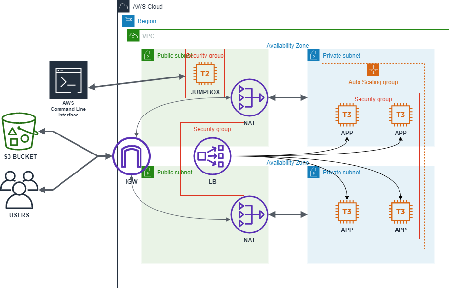
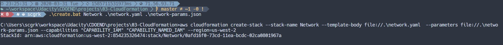
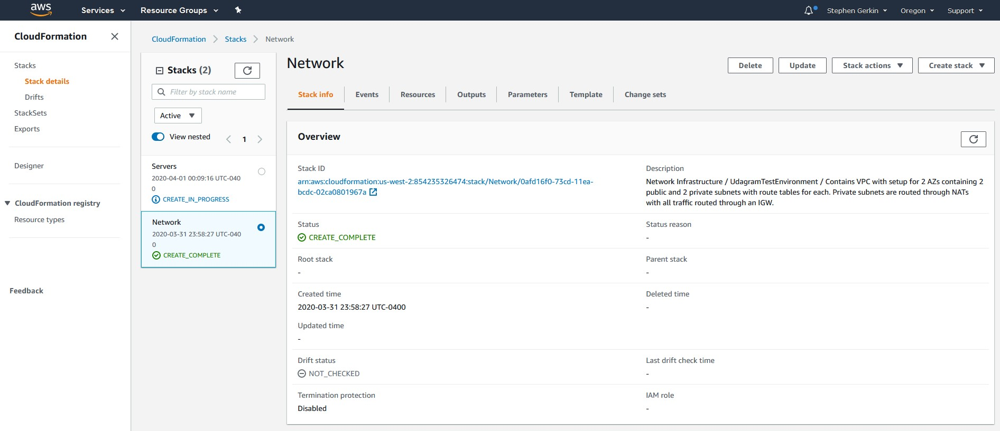
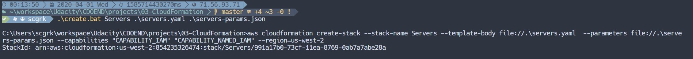
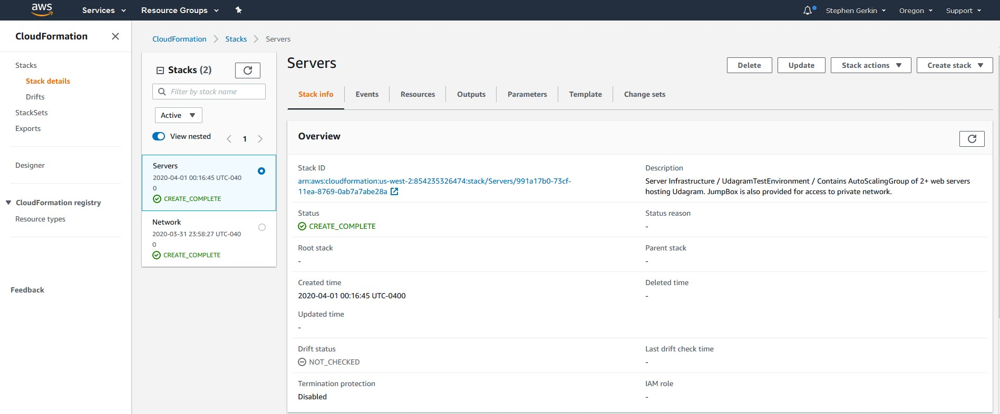
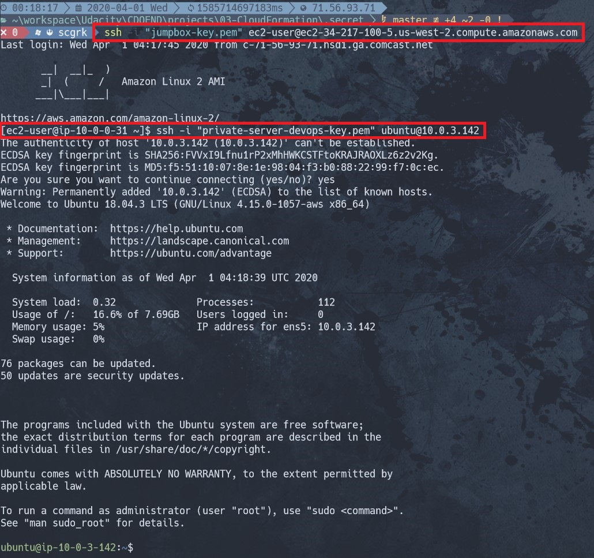
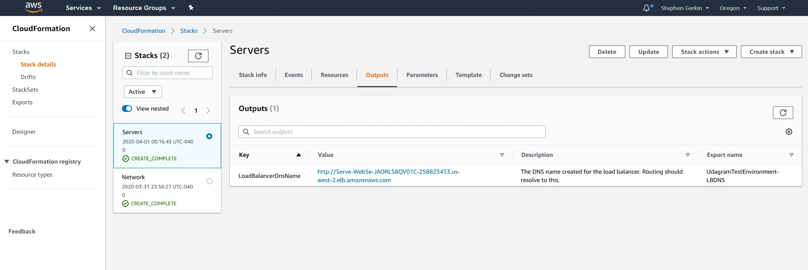
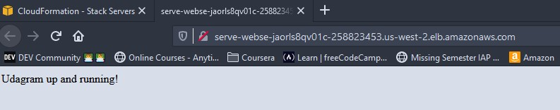

# Udacity - Cloud DevOps Engineer Nanodegree Project

This project was completed for the Udacity Cloud DevOps Engineer Nanodegree, Deploy Infrastructure as Code.

You can find the project specifications and rubric in the information below.

## LoadBalancer DNS
The app can be accessed using the LoadBalancer DNS provided here (while the stack is still active):
[http://serve-webse-jaorls8qv01c-258823453.us-west-2.elb.amazonaws.com/](http://serve-webse-jaorls8qv01c-258823453.us-west-2.elb.amazonaws.com/)

## Diagram Model
The overall infrastructure model can be visualized by following this diagram:


## Set-Up
- The EC2 instances get files from an S3 bucket in order to setup. Information on what to modify for the scripts is included below.
- An IAM Role named `Udagram-EC2-S3-ReadOnly` should exist that allows `GetObject` and `List` on S3 buckets.
- The bucket policy needs to allow this role to perform these actions. A basic policy is included in the [s3-bucket-policy.json](./s3-bucket-policy.json) file included in this directory.

## Usage
The infrastructure is split into two distinct pieces: __Network__ and __Servers__.
As the servers live within the network, the network stack should be created first. This can be accomplished by running the batch script `create.bat` (or `create.sh` for Linux/MacOS), providing the stack name, network infrastructure file name, and the network parameters file name.
```powershell
.\create.bat NetworkStackName network.yaml network-params.json
```
```shell
./create.sh NetworkStackName network.yaml network-params.json
```


The server stack can likewise be created using the same script.
```powershell
.\create.bat ServerStackName servers.yaml servers-params.json
```
```shell
./create.sh ServerStackName servers.yaml servers-params.json
```


The Network must be completely up before doing this, as the Server script requires the outputs created by the Network.

Alternatively, you can run the AWS CLI command directly like so:
```sh
aws cloudformation create-stack
--stack-name <STACK-NAME>
--template-body file://<TEMPLATE-FILE-PATH>
--parameters file://<PARAM-FILE-PATH>
--capabilities "CAPABILITY_IAM" "CAPABILITY_NAMED_IAM"
--region=us-west-2
```

### Note
As seen in the command above, the scripts use `us-west-2` for the region as per the project specification. This can be modified as necessary to deploy the infrastructure to another region.

## UserData Script Modifications
Because the servers get files specific to my S3 buckets, the server `UserData` scripts should be modified to reflect the appropriate S3 bucket that they can use to get the appropriate files.

For the JumpBox:
```shell {.line-numbers highlight=[4-6]}
#!/bin/bash
yum update -y
cd /home/ec2-user
aws s3 cp s3://<LOCATION-OF-PRIVATE-PEM> <NAME-OF-FILE>
chmod 400 <NAME-OF-FILE>.pem
chown ec2-user <NAME-OF-FILE>.pem
```
This copies the key file that can be used by the JumpBox to access the private servers. An admin will be able to SSH directly into this instance using the command:
```sh
ssh -i jumpbox-key.pem ec2-user@<IP-ADDRESS>
```
From there, everything is already setup automatically to allow the admin to SSH directly into the private servers
```
ssh -i <private-pem> ubuntu@<IP-ADDRESS>
```



For the AutoScaling instances:
```shell {.line-numbers highlight=[11-13]}
#!/bin/bash
apt-get update -y
apt install apache2 -y
apt systemctl start apache2.service
apt install awscli -y
apt install unzip -y
cd /var/www
rm -rf html
mkdir html
cd html
aws s3 cp s3://<LOCATION-OF-RESOURCES>.zip <RESOURCE-NAME>.zip
unzip <RESOURCE-NAME>.zip
rm -f <RESOURCE-NAME>.zip
chown -R ubuntu *
```
With this script, the web app will automatically be deployed and can be accessed via the DNS provided by the LoadBalancer. The DNS is output by the servers script allowing for easy access to this for Route 53 resolving as needed.



## Script Details
### [`network.yaml`](./network.yaml)
The network infrastructure sets up:
- A VPC to operate over 2 AZs
- An IGW for access to the world outside the VPC
- 2 Public Subnets (one for each AZ) that are able to access the outside world
- 2 Private Subnets (one for each AZ) that are only able to communicate with the outside through NAT gateways
- 2 NAT Gateways (one for each private subnet)
- Any traffic within the VPC is unrestricted (this is modified further with Security Groups in the Servers setup)
- Routing tables for both private and public subnets.

It requires the parameters provided in the [`network-params.json`](./network-params.json) file.

It outputs references to all resources created for use by the server infrastructure script.

### [`server.yaml`](./server.yaml)
The server infrastructure sets up:
- 3 Security Groups (details can be found inside the script)
    - 1 for a Load Balancer
    - 1 for a JumpBox that can be used to SSH into the web servers living on the private subnets
    - 1 for the web servers
- A static `t3.nano` EC2 instance for the JumpBox that can be used to SSH into the web servers
- An `AutoScalingGroup` of 2 to 6 `t3.medium` EC2 instances running Ubuntu 18.04 Server that will host the web application
    - The servers are set to __NOT__ have a key by default. This should be uncommented to allow for SSH if necessary (or the key can be set via the AWS Management Console)
- A `LoadBalancerElasticV2` for distributing the load amongst the auto-scaled group

It requires the [`servers-params.json`](./servers-params.json) file. Additionally, the parameters should be modified providing an IP address that can access JumpBox (This can be set to `0.0.0.0/0`; however, this is not recommended).

It outputs the DNS provided by the LoadBalancer in a friendly format to click from the Stack Outputs list to test the web app quickly. This can be further used by future scripts to point Route 53 DNS to this and provide a user-friendly URL to the web application.

## Project Specifications
### Problem Statement
Your company is creating an Instagram clone called Udagram. Developers pushed the latest version of their code in a zip file located in a public S3 Bucket.

You have been tasked with deploying the application, along with the necessary supporting software into its matching infrastructure.

This needs to be done in an automated fashion so that the infrastructure can be discarded as soon as the testing team finishes their tests and gathers their results.

### Requirements
You'll need to create a Launch Configuration for your application servers in order to deploy four servers, two located in each of your private subnets. The launch configuration will be used by an auto-scaling group.

You'll need two vCPUs and at least 4GB of RAM. The Operating System to be used is Ubuntu 18. So, choose an Instance size and Machine Image (AMI) that best fits this spec. Be sure to allocate at least 10GB of disk space so that you don't run into issues. 
Security Groups and Roles

Since you will be downloading the application archive from an S3 Bucket, you'll need to create an IAM Role that allows your instances to use the S3 Service.

Udagram communicates on the default HTTP Port: 80, so your servers will need this inbound port open since you will use it with the Load Balancer and the Load Balancer Health Check. As for outbound, the servers will need unrestricted internet access to be able to download and update its software.

The load balancer should allow all public traffic (0.0.0.0/0) on port 80 inbound, which is the default HTTP port. Outbound, it will only be using port 80 to reach the internal servers.

The application needs to be deployed into private subnets with a Load Balancer located in a public subnet.

One of the output exports of the CloudFormation script should be the public URL of the LoadBalancer.

Bonus points if you add http:// in front of the load balancer DNS Name in the output, for convenience.

### Other Considerations
You can deploy your servers with an SSH Key into Public subnets while you are creating the script. This helps with troubleshooting. Once done, move them to your private subnets and remove the SSH Key from your Launch Configuration.

It also helps to test directly, without the load balancer. Once you are confident that your server is behaving correctly, increase the instance count and add the load balancer to your script.

While your instances are in public subnets, you'll also need the SSH port open (port 22) for your access, in case you need to troubleshoot your instances.

Log information for UserData scripts is located in this file: cloud-init-output.log under the folder: /var/log.

You should be able to destroy the entire infrastructure and build it back up without any manual steps required, other than running the CloudFormation script.

The provided UserData script should help you install all the required dependencies. Bear in mind that this process takes several minutes to complete. Also, the application takes a few seconds to load. This information is crucial for the settings of your load balancer health check.

It's up to you to decide which values should be parameters and which you will hard-code in your script.

See the provided supporting code for help and more clues.

If you want to go the extra mile, set up a bastion host to allow you to SSH into your private subnet servers. This bastion host would be on a Public Subnet with port 22 open only to your home IP address, and it would need to have the private key that you use to access the other servers.

### Rubric
Deploy a High-Availability Web App using CloudFormation

#### The Basics
|Criteria|Meets Specifications|
|---|---|
|Parameters|The more the better, but an exaggerated number of parameters can be messy ( say, 10 or more ). 1 or 0 is definitely lacking.|
|Resources|This is the mandatory section of the script, we are looking for a LoadBalancer, Launch Configuration, AutoScaling group a health check, security groups and a Listener and Target Group.|
|Outputs|This is optional, but it would be nice to have a URL here with the Load Balancer DNS Name and “http” in front of it .|
|Working Test|If the student provides a URL to verify his work is running properly, it will be a page that says “it works! Udagram, Udacity”|

#### Load Balancer
|Criteria|Meets Specifications|
|---|---|
|Target Group|The auto-scaling group needs to have a property that associates it with a target group. The Load Balancer will have a Listener rule associated with the same target group|
|Health Check and Listener|Port 80 should be used in Security groups, health checks and listeners associated with the load balancer|

#### Auto-Scaling
|Criteria|Meets Specifications|
|---|---|
|Subnets|Students should be using PRIV-NET ( private subnets ) for their auto-scaling instances|
|Machine Specs|The machine should have 10 GB or more of disk and should be a t3.small or better.|
|SSH Key|There shouldn’t be a ‘keyname’ property in the launch config|

#### Bonus
|Criteria|Meets Specifications|
|---|---|
|Output|Any values in the output section are a bonus|
|Bastion Host|Any resource of type AWS::EC2::Instance, optional, but nice to have.|
